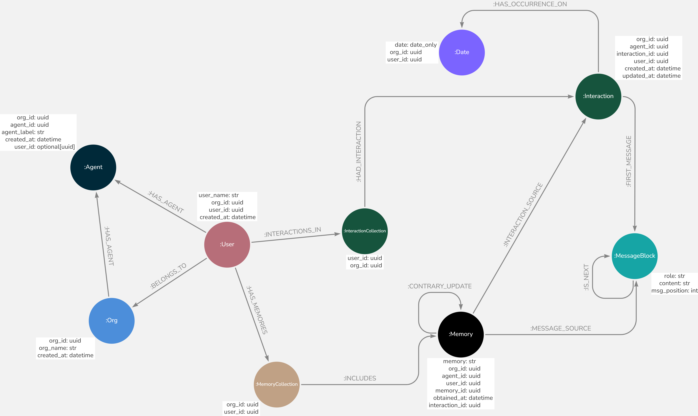

# **Advanced Usage**

## **The Graph Model**



!!! note "Multi-Tenant Design"
    - Memora supports multiple orgs, agents, and users in one system 🏢👥🤖
    - Strategic indexes for fast queries regardless of `MemorySearchScope` ⚡


### **Indexes and Constraints**

- **Organization Node Key (`unique_org_id`)**: Unique identifier for each organization (`org_id`) within the graph.
- **User Node Key (`unique_user_id`)**: Unique combination of `org_id` and `user_id` for each user within an organization.
- **Agent Node Key (`unique_agent_id`)**: Unique combination of `org_id` and `agent_id` for agents.
- **Memory Node Key (`unique_memory_id`)**: Unique combination of `org_id`, `user_id`, and `memory_id` for memories associated with users.
- **Interaction Node Key (`unique_interaction_id`)**: Unique combination of `org_id`, `user_id`, and `interaction_id` for interactions.
- **Interaction Updated Timestamp Index (`index_updated_at`)**: Index on the `updated_at` attribute to facilitate sorting interactions by their most recent update.
- **Date Node Key (`unique_date_id`)**: Unique combination of `org_id`, `user_id`, and `date` for date records associated with users.


### **Organizations and Users**
- Multiple organizations can exist within the system, each with its own set of users and agents.
- Each user has a collection of memories and interactions associated with them.

### **Agents**
- Agents can be associated with an organization or with both an organization and a specific user (allowing for scenarios such as a personalized AI for each user within the organization).

### **Interactions and Memories**
- Users have interactions, which are conversations with agents.
- Each interaction is timestamped and linked to a specific date of occurance.
- Memories are extracted from these interactions and stored in a user's memory collection.
- Memories are also linked to both their source messages and source interactions.
- All contrary updates to a memory are connected, so there is a historical view of memories, enabling tracking of how information evolves over time.

### **Message Structure**
- Interactions consist of message blocks, representing individual messages in a conversation.
- Message blocks are ordered and contain information about the role (user or agent) and content.


## **Integration of Vector and Graph Databases**

Memora integrates vector and graph databases to efficiently manage and search memory data. The vector database, such as Qdrant (with more options coming soon), utilizes both **dense** and **sparse** embeddings (such as SPLADE) to perform hybrid search. Memories are first searched in the vector database, where the vector IDs correspond to the `memory_ids` of memory nodes in the graph database. This design allows for seamless retrieval and resolution of memories from Neo4j, ensuring that the most up-to-date version of a memory is utilized.

!!! note "Name Placeholders 📝"
    Memories are stored using placeholders for user names and agent labels, like `user_{short_uuid} loves peanuts` or `agent_{short_uuid} wishes to go on a trip to Kyoto`. This approach allows for future changes to the user's name or agent label, ensuring that we always use the latest name or label.

Additionally, **indexes** have been created in Qdrant to support multi-tenancy and enable search scopes, such as specific user searches within an organization or searches across organizations.


## **Extending Base Classes**

Memora provides several base classes that can be extended to implement custom functionality:

### **Custom LLM Backend**

To create a custom LLM backend for your llm provider that Memora can use, extend the `BaseBackendLLM` class:

```python
from memora.llm_backends.base import BaseBackendLLM
from typing_extensions import override
from typing import *

class CustomBackendLLM(BaseBackendLLM):
    @override
    async def close(self) -> None:
        # Implement your LLM logic here
        pass

    @property
    @override
    def get_model_kwargs(self) -> Dict[str, Any]:
        # Implement your LLM logic here
        pass

    @abstractmethod
    @override
    async def __call__(self, messages: List[Dict[str, str]], output_schema_model: Type[BaseModel] | None = None) -> Union[str, BaseModel]:
        # Implement your LLM logic here
        pass
```
!!! note
    For more information on the `BaseBackendLLM` class and methods, refer to its [API Reference Page](api/llm_backends/base.md).

### **Custom Graph Database**

To implement a custom graph database that Memora can use, extend the `BaseGraphDB` class:

```python
from memora.graph_db.base import BaseGraphDB
from typing_extensions import override
from typing import *

class CustomGraphDB(BaseGraphDB):
    @override
    async def setup(self):
        # Initialize your graph database
        pass

    @override
    async def create_organization(self, org_name: str) -> Dict[str, str]:
        # Implement organization creation logic
        pass

    # Implement other required methods
```

!!! note
    For more information on the `BaseGraphDB` class and methods, refer to its [API Reference Page](api/graph_db/base.md).

### **Custom Vector Database**

To implement a custom vector database that Memora can use, extend the `BaseVectorDB` class:

```python
from memora.vector_db.base import BaseVectorDB
from typing_extensions import override
from typing import *

class CustomVectorDB(BaseVectorDB):

    @override
    async def close(self) -> None:
        pass

    @override
    async def setup(self):
        # Initialize your vector database
        pass

    # Implement other required methods
```

!!! note
    For more information on the `BaseVectorDB` class and methods, refer to its [API Reference Page](api/vector_db/base.md).

### **Extending Existing Implementations**

If you need to extend an existing implementation, such as the Neo4j graph interface or the Qdrant vector database, you can create a subclass:

```python
from memora.graph_db import Neo4jGraphInterface

class ExtendedNeo4jGraph(Neo4jGraphInterface):
    # Intialize parent class and add your methods.
    pass

from memora.vector_db import QdrantDB

class ExtendedQdrantDB(QdrantDB):
    # Intialize parent class and add your methods.
    pass

# Note: This can also be done for any of the `BaseBackendLLM` implementations like GroqBackendLLM, TogetherBackendLLM, etc. So you can enable streaming, tools, etc.
```

!!! note
    - For more information on the `Neo4jGraphInterface` class and methods, refer to its [API Reference Page](api/graph_db/neo4j.md).
    - For more information on the `QdrantDB` class and methods, refer to its [API Reference Page](api/vector_db/qdrant.md).

By extending these classes, you can tailor Memora to your specific use case while maintaining compatibility with the core functionality.


