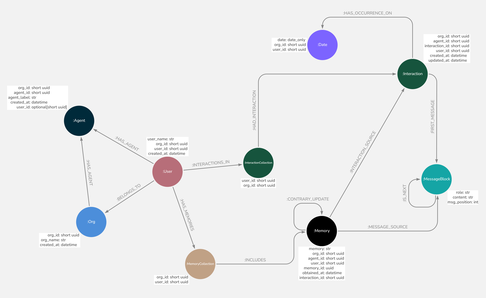

# **Advanced Usage**

## **The Graph Model**



!!! note "Multi-Tenant Design"
    - Memora accommodates multiple organizations, agents, and users in one system 🏢👥🤖
    - Strategic indexes for fast queries regardless of `MemorySearchScope` ⚡


### **Indexes and Constraints**

- **Organization Node Key (`unique_org_id`)**: Unique identifier for each organization (`org_id`) within the graph.
- **User Node Key (`unique_user_id`)**: Unique combination of `org_id` and `user_id` for each user within an organization.
- **Agent Node Key (`unique_agent_id`)**: Unique combination of `org_id` and `agent_id` for agents.
- **Memory Node Key (`unique_memory_id`)**: Unique combination of `org_id`, `user_id`, and `memory_id` for memories associated with users.
- **Interaction Node Key (`unique_interaction_id`)**: Unique combination of `org_id`, `user_id`, and `interaction_id` for interactions.
- **Interaction Updated Timestamp Index (`index_updated_at`)**: Index on the `updated_at` attribute to facilitate sorting interactions by their most recent update.
- **Date Node Key (`unique_date_id`)**: Unique combination of `org_id`, `user_id`, and `date` for date records associated with users.


### **Organizations and Users**
- Multiple organizations can exist within the system, each with its own set of users and agents.
- Each user has a collection of memories and interactions associated with them.

### **Agents**
- Agents can be associated with an organization or with both an organization and a specific user (allowing for scenarios such as a personalized AI for each user within the organization).

### **Interactions and Memories**
- Users have interactions, which are conversations with agents.
- Each interaction is timestamped and linked to a specific date of occurance.
- Memories are extracted from these interactions and stored in a user's memory collection.
- Memories are also linked to both their source messages and source interactions.
- All contrary updates to a memory are connected, so there is a historical view of memories, enabling tracking of how information evolves over time.

### **Message Structure**
- Interactions consist of message blocks, representing individual messages in a conversation.
- Message blocks are ordered and contain information about the role (user or agent) and content.


## **Integration of Vector and Graph Databases**

Memora integrates vector and graph databases to efficiently manage and search memory data. The vector database, such as Qdrant (with more options coming soon), utilizes both **dense** and **sparse** embeddings (such as SPLADE) to perform hybrid search. Memories are first searched in the vector database, where the vector IDs correspond to the `memory_ids` of memory nodes in the graph database. This design allows for seamless retrieval and resolution of memories from Neo4j, ensuring that the most up-to-date version of a memory is utilized.

!!! note "Name Placeholders 📝"
    Memories are stored using placeholders for user names and agent labels, like `user_{short_uuid} loves peanuts` or `agent_{short_uuid} wishes to go on a trip to Kyoto`. This approach allows for future changes to the user's name or agent label, ensuring that we always use the latest name or label.

Additionally, **indexes** have been created in Qdrant to support multi-tenancy and enable search scopes, such as specific user searches within an organization or searches across organizations.


## **Reducing Memory Search Latency**

Instead of using `await memora.recall_memories_for_message(...)`, which internally first calls a model to generate search queries, you can achieve better latency by:

1. Having your chat model generate the memory search queries directly
2. Passing these queries to `await memora.search_memories_as_one(...)`

This approach bypasses an extra model call to generate memory queries, reducing both token usage and latency. Here's a simple example:

```python
from openai import AsyncOpenAI
import json

... # Preceding code where you have initialized memora, and stored org_id and user_id in variables.

# Define the memory search tool
tools = [
    {
        "type": "function",
        "function": {
            "name": "search_memories",
            "description": "Search through user's memories with specific queries.",
            "parameters": {
                "type": "object",
                "properties": {
                    "queries": {
                        "type": "array",
                        "items": {"type": "string"},
                        "description": "List of search queries to find relevant memories."
                    }
                },
                "required": ["queries"]
            }
        },
    }
]

# Async client initialization
client = AsyncOpenAI(api_key="YourOpenAIAPIKey")

messages=[
    {
        "role": "system", 
        "content": "You are an assistant. When responding to the user, if you need memory to provide the best response, call the 'search_memories' tool with the required search queries."
    },
    {
        "role": "user", 
        "content": "Hey, what’s the name of the restaurant we went to last weekend? The one with the amazing tacos?"
    }
]

# Step 1: Prompt the model.
response = await client.chat.completions.create(
    model="gpt-4o",
    messages=messages,
    tools=tools  # Include the memory search tool in the request
)

# Step 2: Extract the response and any tool call responses
response_message = response.choices[0].message
tool_calls = response_message.tool_calls

messages.append(response_message) # Add the LLM's response to the conversation

if tool_calls: # The memory search tool was called.

    # There is only one tool (memory search, so we just extract the arguments).
    search_args = json.loads(tool_calls[0].function.arguments)  # Example: {"queries": ["restaurant last weekend", "amazing tacos"]}
    queries = search_args["queries"] # ["restaurant last weekend", "amazing tacos"]

    # Step 3: Perform memory search with queries as a single batch
    recalled_memories = await memora.search_memories_as_one(
        org_id=org_id,
        user_id=user_id,
        search_queries=queries,
        search_across_agents=True
    )

    # recalled_memories: [
    # Memory(..., memory_id='uuid string', memory="Jake confirmed Chezy has the best tacos, saying his mouth literally watered.", obtained_at=datetime(...), message_sources=[...]),
    # Memory(..., memory_id='uuid string', memory="Jake is planing to go to Chezy this weekend.", obtained_at=datetime(...), message_sources=[...]),
    #...]

    # Add the tool response to the conversation
    messages.append(
        {
            "tool_call_id": tool_calls[0].id, 
            "role": "tool", # Indicates this message is from tool use
            "name": "search_memories",
            "content": str([memory.memory_and_timestamp_dict() for memory in recalled_memories]),
        }
    )

    # Make a final API call with the updated conversation that has the memories of the tool call.
    final_response = await client.chat.completions.create(
        model="gpt-4o",
        messages=messages
    )
    
    # Print the final response
    print(f">>> Assistant Reply: {final_response.choices[0].message.content}")

else: # The memory search tool wasn't called
    print(f">>> Assistant Reply: {response_message.content}")
```

!!! note
    If you deploy the graph and vector database very close to your application, it reduces latency caused by network trips a lot.


## **Extending Base Classes**

Memora provides several base classes that can be extended to implement custom functionality:

### **Custom LLM Backend**

To create a custom LLM backend for your llm provider that Memora can use, extend the `BaseBackendLLM` class:

```python
from memora.llm_backends.base import BaseBackendLLM
from typing_extensions import override
from pydantic import BaseModel
from typing import Any, Dict, List, Type, Union

class CustomBackendLLM(BaseBackendLLM):

    def __init__(
        self,
        model: str, 
        temperature: float = 1,
        top_p: float = 1,
        max_tokens: int = 1024,
        # Or Any arguments you want.
    ):
        """
        Initialize the CustomBackendLLM class with specific parameters.

        Example (May Differ for your case):
            self.custom_client = AsyncCustomClient(...)

            self.model = model
            self.temperature = temperature
            self.top_p = top_p
            self.max_tokens = max_tokens
        """
        pass

    @override
    async def close(self) -> None: 
        """
        Closes the LLM connection.
        
        Example (May Differ for your case):
            await self.custom_client.close()
            self.custom_client = None

            OR JUST
            self.custom_client = None
        """
        pass

    @property
    @override
    def get_model_kwargs(self) -> Dict[str, Any]:
        """
        Returns dictionary of model configuration parameters
        
        Example (May have more parameters for your case):
            return {
                "model": self.model, # model_name: gpt-4o
                "temperature": self.temperature, # 1
                "top_p": self.top_p, # 1
                "max_tokens": self.max_tokens, # 1024
                "stream": False,
            }
        """
        pass

    @abstractmethod
    @override
    async def __call__(self, messages: List[Dict[str, str]], output_schema_model: Type[BaseModel] | None = None) -> Union[str, BaseModel]:
        """
        Process messages and generate response (📌 Streaming is not supported, as full response is required at once)

        Args:
            messages (List[Dict[str, str]]): List of message dicts with role and content e.g [{"role": "user", "content": "Hello!"}, ...]
            output_schema_model (Type[BaseModel] | None): Optional Pydantic base model for structured output (📌 Ensure your model provider supports this for the chosen model)

        Returns:
            Union[str, BaseModel]: Generated text response as a string, or an instance of the output schema model if specified

        Example (May Differ for your case):
            if output_schema_model:
                response = await self.custom_client.chat.completions.create(
                    messages=messages,
                    **self.get_model_kwargs,
                    response_format={"type": "json_object"},
                )
                content = response.choices[0].message.content
                return output_schema_model.model_validate_json(content)

            else:
                response = await self.custom_client.chat.completions.create(
                    messages=messages,
                    **self.get_model_kwargs,
                )
                return response.choices[0].message.content
        """
        pass
```
!!! note
    For more information on the `BaseBackendLLM` class and methods, refer to its [API Reference Page](api/llm_backends/base.md).

### **Custom Graph Database**

To implement a custom graph database that Memora can use, extend the `BaseGraphDB` class:

```python
from memora.graph_db.base import BaseGraphDB
from memora.schema import models
from typing_extensions import override

class CustomGraphDB(BaseGraphDB):
    @override
    async def setup(self):
        # Initialize your graph database
        pass

    @override
    async def create_organization(self, org_name: str) -> models.Organization:
        # Implement organization creation logic
        pass

    # Implement other required methods
```

!!! note
    For more information on the `BaseGraphDB` class and methods, refer to its [API Reference Page](api/graph_db/base.md).

### **Custom Vector Database**

To implement a custom vector database that Memora can use, extend the `BaseVectorDB` class:

```python
from memora.vector_db.base import BaseVectorDB
from typing_extensions import override

class CustomVectorDB(BaseVectorDB):

    @override
    async def close(self) -> None:
        pass

    @override
    async def setup(self):
        # Initialize your vector database
        pass

    # Implement other required methods
```

!!! note
    For more information on the `BaseVectorDB` class and methods, refer to its [API Reference Page](api/vector_db/base.md).

### **Extending Existing Implementations**

If you need to extend an existing implementation, such as the Neo4j graph interface or the Qdrant vector database, you can create a subclass:

```python
from memora.graph_db import Neo4jGraphInterface

class ExtendedNeo4jGraph(Neo4jGraphInterface):
    # Intialize parent class and add your methods.
    pass

from memora.vector_db import QdrantDB

class ExtendedQdrantDB(QdrantDB):
    # Intialize parent class and add your methods.
    pass

# Note: This can also be done for any of the `BaseBackendLLM` implementations like GroqBackendLLM, TogetherBackendLLM, etc. So you can enable streaming, tools, etc.
```

!!! note
    - For more information on the `Neo4jGraphInterface` class and methods, refer to its [API Reference Page](api/graph_db/neo4j.md).
    - For more information on the `QdrantDB` class and methods, refer to its [API Reference Page](api/vector_db/qdrant.md).

By extending these classes, you can tailor Memora to your specific use case while maintaining compatibility with the core functionality.


