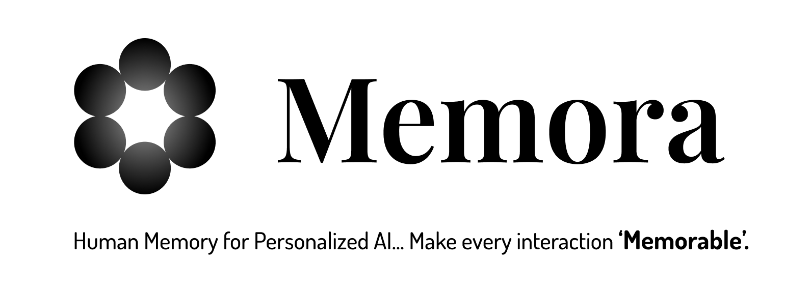

<p align="center">
    <a href="https://pepy.tech/projects/memora-core">
        
    </a>
    <a href="https://pypi.org/project/memora-core" target="_blank">
        
    </a>
    <a href="https://github.com/elzai/memora/blob/main/LICENSE">    
        
    </a>
</p>

# **Documentation**

When we interact with people 🗣️👂, we naturally remember details from past interactions 💭, feelings 😜😢, and shared experiences 🤝. That's what makes us human. **We're bringing this same ability to AI, helping it recall just like us.**

## **Features**

- **Temporal Memory Recall**: Enables AI to remember timestamped memories from past interactions, tracking updates to show how information evolves over time.

- **Multi-Tenancy**: Designed to accommodate multiple organizations, agents, and users along their interactions and memories.

- **Flexible Name Handling**: Uses placeholders for user and agent names in memories, allowing easy updates if names change later.

- **Scalability**: Designed to scale to millions of users, interactions, memories etc. with strategic indexes and constraints for very fast search.

- **Developer-Friendly Design**: Provides a modular architecture that allows you to adapt it to fit your specific needs with integration of new features etc.


## **Our Vision** 🔭

Currently, Memora manages text-based memories, assisting AI in maintaining context and evolving over time. However, our dream is way bigger towards the full spectrum of human memory, enabling AI to interact as naturally as a close friend. This will need:

- **Emotion-Tagged Memories**: Allowing AI to recall memories along with the emotions experienced at that time, such as joy 😄, sadness 😢, surprise 😲...

- **Multi-modal Memories**: As we move into an era where AI is ever-present (24/7), it should be capable of recalling video 🎥 and audio 🔉 segments from interactions, akin to how **humans** replay past events as a mental film in our heads.


## **Join Us!**

We're building Memora in the open, and we'd love your 🫵 help. No contribution is too small, even fixing typos ✏️. Check out our [CONTRIBUTING.md](https://github.com/ELZAI/memora/blob/main/CONTRIBUTING.md).

Let's give AI a human touch, together! 😁

## Project Structure

```
memora/
├── agent/          # The Orchestrator
├── graph_db/       # Graph database implementation
├── llm_backends/   # Backend LLM implementations for Memora
├── prompts/        # Prompts for memory operations
├── schema/         # Data models and schemas
└── vector_db/      # Vector database implementation
```

## Next Steps

- [Getting Started](getting_started.md) - Set up and use Memora.
- [Advanced Usage](advanced_usage.md) - Explore advanced use cases and custom implementations
- [API Reference](api/index.md) - Detailed API documentation
